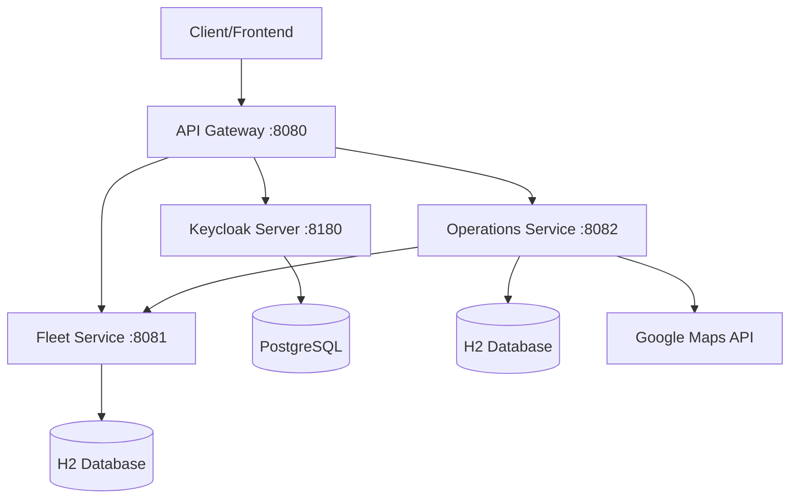

# TPI Backend - Sistema de Gestión de Transporte

Sistema de microservicios para gestión de transporte de contenedores con cálculo automático de costos y rutas.

## Arquitectura



## Servicios

### API Gateway
- Punto de entrada único
- Enrutamiento a microservicios
- Circuit breaker y retry policies

### Servicio Flota
- Gestión de camiones y transportistas
- Configuración de tarifas
- Gestión de depósitos

### Servicio Operaciones
- Gestión de clientes y contenedores
- Creación y seguimiento de solicitudes
- Planificación de rutas con Google Maps
- Cálculo de costos de transporte

## Requisitos

- Java 21
- Maven 3.8+
- Keycloak 23+
- Google Maps API Key

## Configuración

### 1. Keycloak
```bash
# Importar realm configurado
# Archivo: keycloak-realm-export.json
```

### 2. Google Maps API
Configurar en `servicio-operaciones/src/main/resources/application.properties`:
```properties
google.maps.api-key=TU_API_KEY_AQUI
```

### 3. Iniciar Servicios
```bash
# Terminal 1 - API Gateway
cd api-gateway
mvn spring-boot:run

# Terminal 2 - Servicio Flota
cd servicio-flota
mvn spring-boot:run

# Terminal 3 - Servicio Operaciones
cd servicio-operaciones
mvn spring-boot:run
```

## Uso

### Swagger UI
- Servicio Flota: http://localhost:8081/swagger-ui.html
- Servicio Operaciones: http://localhost:8082/swagger-ui.html

### Postman
Importar la colección `TPI-Backend-Postman-Collection.json` y ejecutar el flujo E2E completo.

Ver [POSTMAN-GUIA.md](POSTMAN-GUIA.md) para más detalles.

## Flujo de Negocio

1. **Configuración Inicial**
   - Crear tarifas de transporte
   - Registrar camiones y depósitos
   - Registrar clientes

2. **Solicitud de Transporte**
   - Cliente solicita transporte de contenedor
   - Sistema calcula ruta óptima con Google Maps
   - Se divide en tramos según depósitos intermedios

3. **Ejecución**
   - Asignar camión a cada tramo
   - Iniciar tramo (comienza el viaje)
   - Finalizar tramo (calcula costo real)
   - Finalizar solicitud (costo total)

## Cálculo de Costos

El costo de cada tramo se calcula con:
- **Cargo de gestión:** Fijo por tramo
- **Costo por kilometraje:** Costo/km del camión × distancia
- **Costo de combustible:** Consumo/km × distancia × precio combustible
- **Costo de estadía:** Si termina en depósito intermedio

## Documentación Adicional

- [CORRECCIONES-IMPLEMENTADAS.md](CORRECCIONES-IMPLEMENTADAS.md) - Cambios realizados para el funcionamiento correcto
- [POSTMAN-GUIA.md](POSTMAN-GUIA.md) - Guía de uso de la colección Postman
- [Endpoints-Documentacion.md](Endpoints-Documentacion.md) - Documentación detallada de endpoints

## Credenciales de Prueba

**Usuario Admin:**
- Username: `admin`
- Password: `admin123`
- Roles: ADMIN, FLOTA_MANAGER, OPERACIONES_MANAGER

## Tecnologías

- Spring Boot 3.4
- Spring Cloud Gateway
- Spring Security OAuth2 Resource Server
- Keycloak
- H2 Database (desarrollo)
- Google Maps API
- Swagger/OpenAPI 3.0
